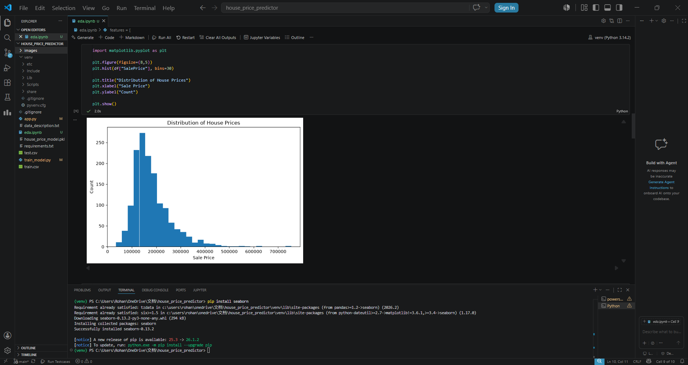
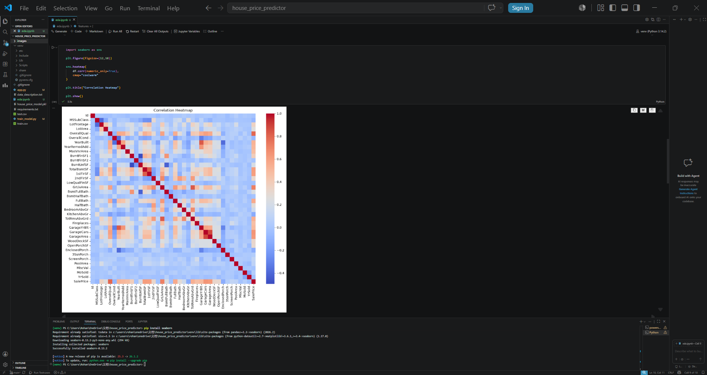
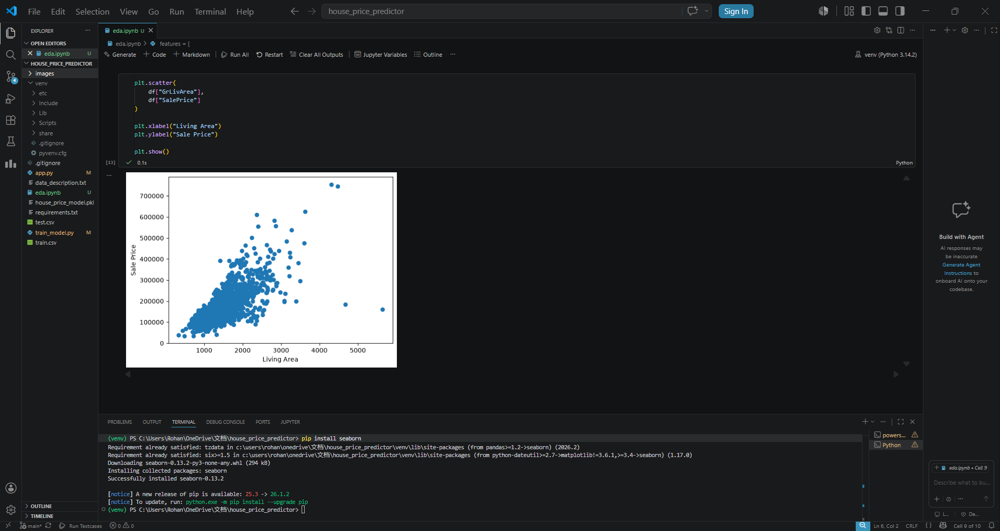

# 🏠 AI-Powered House Price Prediction System

A Machine Learning web application that predicts house prices using the **Kaggle House Prices: Advanced Regression Techniques** dataset. The model is trained using **Random Forest Regression** and deployed using **Streamlit** for real-time predictions.

---

# 🌐 Live Demo

https://house-price-predictor-7fegqrki34ccbu2an67q3l.streamlit.app

---

# 📂 GitHub Repository

https://github.com/Rohan110010/house-price-predictor

---

# 📌 Project Overview

This project was built to understand the complete Machine Learning pipeline—from **Exploratory Data Analysis (EDA)** to **model training**, **evaluation**, and **deployment**.

The application predicts the selling price of a house based on six important features:

- Overall Quality
- Living Area
- Garage Capacity
- Number of Full Bathrooms
- Number of Bedrooms
- Year Built

The trained model achieved an **R² Score of approximately 0.88** on unseen test data.

---

# 🚀 Features

- Predicts house prices using Machine Learning
- Trained on the Kaggle House Prices dataset
- Random Forest Regression model
- Interactive Streamlit web interface
- Real-time house price prediction
- Property summary after prediction
- Deployed on Streamlit Community Cloud

---

# 📊 Dataset

**Source:** Kaggle – House Prices: Advanced Regression Techniques

- Houses: **1460**
- Features: **81**
- Target Variable: **SalePrice**

Dataset Link:

https://www.kaggle.com/competitions/house-prices-advanced-regression-techniques

---

# 🤖 Machine Learning Pipeline

```text
Kaggle Dataset
        │
        ▼
Exploratory Data Analysis (EDA)
        │
        ▼
Feature Selection
        │
        ▼
Train-Test Split (80:20)
        │
        ▼
Random Forest Regression
        │
        ▼
Model Evaluation (R² Score)
        │
        ▼
Model Serialization (Joblib)
        │
        ▼
Streamlit Web Application
        │
        ▼
Deployment
```

---

# 🤖 Why Random Forest Regression?

Random Forest Regressor was selected because:

- House prices have non-linear relationships with input features.
- It reduces overfitting compared to a single Decision Tree.
- It combines predictions from multiple Decision Trees.
- It provides better generalization on unseen data.
- It achieved better performance than Linear Regression on this dataset.

---

# 📊 Model Performance

| Metric | Value |
|---------|-------|
| Model | Random Forest Regressor |
| R² Score | 0.88 |
| Training Split | 80% |
| Testing Split | 20% |
| Dataset | Kaggle House Prices |
| Features Used | 6 |

---

# 🛠️ Tech Stack

- Python
- Pandas
- NumPy
- Scikit-learn
- Random Forest Regression
- Joblib
- Streamlit
- Git
- GitHub

---

# 📷 Application Preview

## 🏠 Home Screen


---

## 📈 Prediction Result


---

# 📊 Exploratory Data Analysis (EDA)

Before training the model, Exploratory Data Analysis (EDA) was performed to understand the dataset and identify the most influential features affecting house prices.

## Dataset Overview

| Property | Value |
|----------|-------|
| Dataset | Kaggle House Prices |
| Houses | 1460 |
| Features | 81 |
| Target Variable | SalePrice |

---

## EDA Performed

- Examined dataset shape and feature information
- Checked data types and missing values
- Generated summary statistics
- Visualized the distribution of house prices
- Created a correlation heatmap
- Analyzed relationships between important features and SalePrice
- Selected the six most relevant features based on correlation analysis and domain knowledge

---

## Key Findings

- The dataset contains **1460 houses** and **81 features**.
- **OverallQual** showed the strongest positive correlation with SalePrice.
- Houses with larger **GrLivArea** generally have higher selling prices.
- Greater **Garage Capacity** is associated with higher house prices.
- Newer houses (**YearBuilt**) generally have higher market values.
- Based on EDA and domain knowledge, the following six features were selected:
  - OverallQual
  - GrLivArea
  - GarageCars
  - FullBath
  - BedroomAbvGr
  - YearBuilt

---

## 📈 EDA Visualizations

### Distribution of House Prices



---

### Correlation Heatmap



---

### Living Area vs Sale Price



---

# ⚙️ Installation

Clone the repository

```bash
git clone https://github.com/Rohan110010/house-price-predictor.git
```

Move into the project directory

```bash
cd house-price-predictor
```

Install dependencies

```bash
pip install -r requirements.txt
```

Run the application

```bash
streamlit run app.py
```

---

# 💡 Skills Demonstrated

- Exploratory Data Analysis (EDA)
- Data Preprocessing
- Feature Selection
- Machine Learning
- Random Forest Regression
- Model Evaluation
- Train-Test Split
- Model Serialization using Joblib
- Streamlit Deployment
- Git & GitHub

---

# 🔮 Future Improvements

- Hyperparameter Tuning using GridSearchCV
- Cross Validation
- Feature Importance Visualization
- SHAP Explainability
- Docker Deployment
- Cloud Deployment using AWS

---

# 👨‍💻 Author

**Rohan Kumar**

GitHub:

https://github.com/Rohan110010

---

⭐ If you found this project helpful, consider giving it a star!


