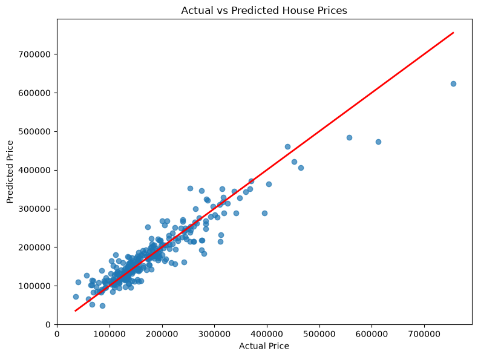

# 🏠 AI-Powered House Price Prediction System

A Machine Learning web application that predicts house prices using the **Kaggle House Prices: Advanced Regression Techniques** dataset. The model is built using **Random Forest Regression** and deployed with **Streamlit** for real-time predictions.

---

# 🌐 Live Demo

https://house-price-predictor-7fegqrki34ccbu2an67q3l.streamlit.app

---

# 📂 GitHub Repository

https://github.com/Rohan110010/house-price-predictor

---

# 📌 Project Overview

This project was built to understand the complete Machine Learning workflow—from **Exploratory Data Analysis (EDA)** to **model training**, **evaluation**, and **deployment**.

The application predicts house prices based on six important features:

- Overall Quality
- Ground Living Area
- Garage Capacity
- Number of Full Bathrooms
- Number of Bedrooms
- Year Built

The trained Random Forest model achieved an **R² Score of approximately 0.88** on unseen test data.

---

# 🚀 Features

- House price prediction using Machine Learning
- Random Forest Regression
- Interactive Streamlit Web Application
- Real-time predictions
- Property summary after prediction
- Model evaluation using R², MAE and RMSE
- Deployed using Streamlit Community Cloud

---

# 📊 Dataset

**Dataset:** Kaggle House Prices: Advanced Regression Techniques

- Houses : **1460**
- Features : **81**
- Target Variable : **SalePrice**

https://www.kaggle.com/competitions/house-prices-advanced-regression-techniques

---

# 🔄 Machine Learning Workflow

```
Kaggle Dataset
        │
        ▼
Exploratory Data Analysis (EDA)
        │
        ▼
Feature Selection
        │
        ▼
Train-Test Split (80:20)
        │
        ▼
Random Forest Regression
        │
        ▼
Model Evaluation
(R² • MAE • RMSE)
        │
        ▼
Model Serialization (Joblib)
        │
        ▼
Streamlit Web Application
        │
        ▼
Deployment
```

---

# 🤖 Why Random Forest?

Random Forest Regressor was selected because:

- House prices have complex non-linear relationships.
- It reduces overfitting compared to a single Decision Tree.
- It combines predictions from multiple Decision Trees.
- It generalizes well on unseen data.
- It achieved better performance than Linear Regression for this problem.

---

# 📊 Model Performance

| Metric | Value |
|---------|-------|
| Model | Random Forest Regressor |
| R² Score | 0.88 |
| Train/Test Split | 80 : 20 |
| Features Used | 6 |

---

# 📷 Application Preview

## Home Screen


---

## Prediction Result


---

# 📊 Exploratory Data Analysis (EDA)

Before training the model, Exploratory Data Analysis (EDA) was performed to understand the dataset and identify the most influential features affecting house prices.

### EDA Included

- Dataset shape analysis
- Feature information
- Missing value analysis
- Summary statistics
- SalePrice distribution
- Correlation heatmap
- Scatter plot analysis
- Feature selection

### Key Findings

- Dataset contains **1460 houses** with **81 features**.
- OverallQual showed the strongest positive correlation with SalePrice.
- Larger living area generally increases house prices.
- Garage capacity and YearBuilt positively influence price.
- Based on EDA and domain knowledge, the following features were selected:

- OverallQual
- GrLivArea
- GarageCars
- FullBath
- BedroomAbvGr
- YearBuilt

### Sale Price Distribution


---

### Correlation Heatmap


---

### Living Area vs Sale Price


---

# 📈 Model Evaluation

The trained model was evaluated on unseen test data.

Evaluation metrics used:

- R² Score
- Mean Absolute Error (MAE)
- Root Mean Squared Error (RMSE)

### Actual vs Predicted Prices



---

# 🛠 Tech Stack

- Python
- Pandas
- NumPy
- Matplotlib
- Scikit-learn
- Random Forest Regression
- Joblib
- Streamlit
- Git
- GitHub

---

# 📂 Project Structure

```
house-price-predictor/
│
├── app.py
├── train_model.py
├── House_Price_EDA.ipynb
├── train.csv
├── test.csv
├── house_price_model.pkl
├── requirements.txt
├── README.md
│
├── images/
│   ├── saleprice_distribution.png
│   ├── correlation_heatmap.png
│   ├── grlivarea_vs_saleprice.png
│   └── actual_vs_predicted.png
│
└── screenshots/
```

---

# ⚙️ Installation

```bash
git clone https://github.com/Rohan110010/house-price-predictor.git

cd house-price-predictor

pip install -r requirements.txt

streamlit run app.py
```

---

# 💡 Skills Demonstrated

- Exploratory Data Analysis
- Feature Selection
- Data Preprocessing
- Machine Learning
- Random Forest Regression
- Model Evaluation
- Model Serialization
- Streamlit Deployment
- Git & GitHub

---

# 🔮 Future Improvements

- Hyperparameter Tuning
- Cross Validation
- Feature Importance Visualization
- SHAP Explainability
- Docker Deployment
- AWS Deployment

---

# 👨‍💻 Author

**Rohan Kumar Singh**

GitHub:
https://github.com/Rohan110010

---

⭐ If you found this project useful, consider giving it a star.
